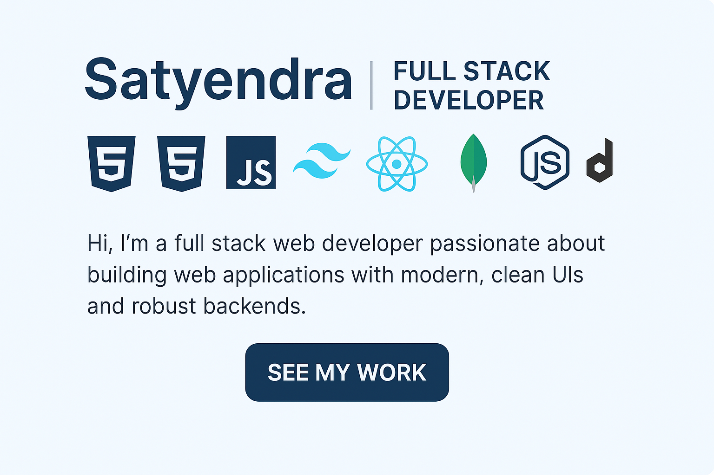

# 💼 Satyendra's Developer Portfolio

Welcome to my personal portfolio site! I'm a passionate **Full Stack Web Developer** skilled in building modern, responsive web applications using:

- 🛠️ HTML, CSS, JavaScript, Tailwind
- ⚛️ React, Node.js, Express, MongoDB
- 💻 C, C++, Python, Java (basic)

## 🚀 Live Site

🔗 [View Portfolio](https://Satyendra-official.github.io/portfolio/)

## 📌 Projects Featured

- **Weather App** – API integration and real-time data handling
- **Todo App** – React hooks & state management
- More projects coming soon...

## 📬 Contact

- 📧 Email: [satyendray2306@gmail.com](mailto:satyendray2306@gmail.com)
- 🐱 GitHub: [github.com/Satyendra-official](https://github.com/Satyendra-official)
- 💼 LinkedIn: [linkedin.com/in/satyendra-kr-yadav](https://www.linkedin.com/in/satyendra-kr-yadav/)

---

Thanks for visiting! 🚀
